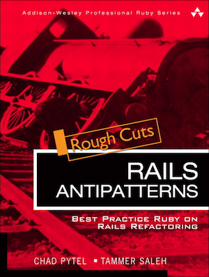

[](https://gitpitch.com/enogrob/ebook-rails-antipatterns/master)
```
Roberto Nogueira  
BSd EE, MSd CE
Solution Integrator Experienced - Certified by Ericsson
```
# eBook Rails Antipatterns



**About**

Learn everything you need to about the subject of this `eBook` project.

[Homepage](http://www.informit.com/store/rails-antipatterns-best-practice-ruby-on-rails-refactoring-9780321620286)

## Topics
```
Foreword        
[ ] Introduction        
[ ] Acknowledgments          
[ ] About the Authors

Chapter 1: Models         
[ ] AntiPattern: Voyeuristic Models   
[ ] AntiPattern: Fat Models  
[ ] AntiPattern: Spaghetti SQL  
[ ] AntiPattern: Duplicate Code Duplication  

Chapter 2: Domain Modeling      
[ ] AntiPattern: Authorization Astronaut  
[ ] AntiPattern: The Million-Model March  

Chapter 3: Views        
[ ] AntiPattern: PHPitis  
[ ] AntiPattern: Markup Mayhem

Chapter 4: Controllers         
[ ] AntiPattern: Homemade Keys  
[ ] AntiPattern: Fat Controller  
[ ] AntiPattern: Bloated Sessions  
[ ] AntiPattern: Monolithic Controllers  
[ ] AntiPattern: Controller of Many Faces  
[ ] AntiPattern: A Lost Child Controller  
[ ] AntiPattern: Rat’s Nest Resources
[ ] AntiPattern: Evil Twin Controllers  

Chapter 5: Services        
[ ] AntiPattern: Fire and Forget
[ ] AntiPattern: Sluggish Services
[ ] AntiPattern: Pitiful Page Parsing
[ ] AntiPattern: Successful Failure
[ ] AntiPattern: Kraken Code Base

Chapter 6: Using Third-Party Code    
[ ] AntiPattern: Recutting the Gem  
[ ] AntiPattern: Amateur Gemologist  
[ ] AntiPattern: Vendor Junk Drawer
[ ] AntiPattern: Miscreant Modification

Chapter 7: Testing     
[ ] AntiPattern: Fixture Blues  
[ ] AntiPattern: Lost in Isolation
[ ] AntiPattern: Mock Suffocation
[ ] AntiPattern: Untested Rake
[ ] AntiPattern: Unprotected Jewels

Chapter 8: Scaling and Deploying
[ ] AntiPattern: Scaling Roadblocks
[ ] AntiPattern: Disappearing Assets   
[ ] AntiPattern: Sluggish SQL   
[ ] AntiPattern: Painful Performance   

Chapter 9: Databases         
[ ] AntiPattern: Messy Migrations   
[ ] AntiPattern: Wet Validations   

Chapter 10: Building for Failure         
[ ] AntiPattern: Continual Catastrophe   
[ ] AntiPattern: Inaudible Failures  
```
